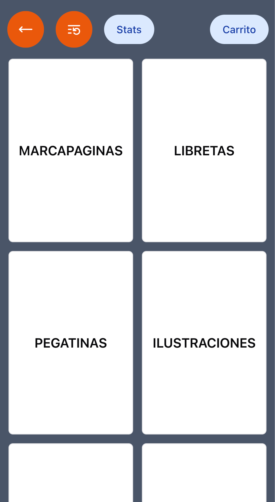
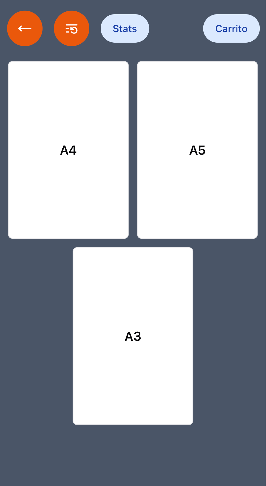
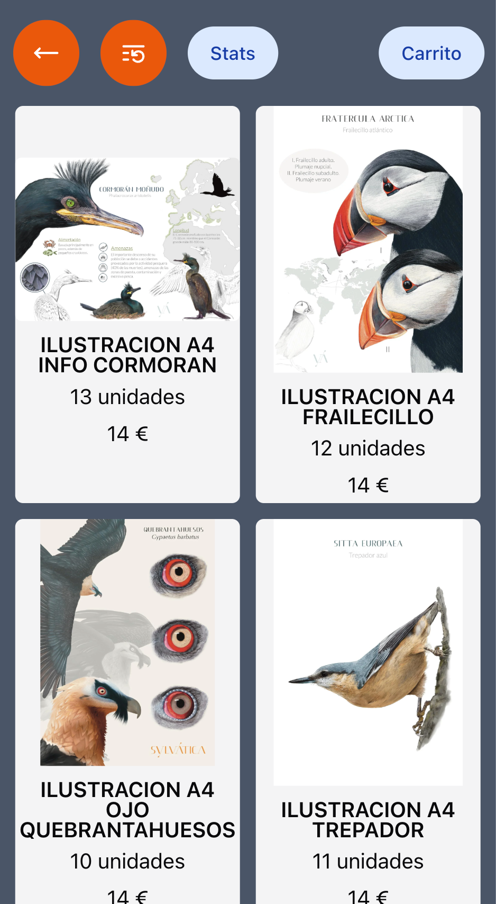
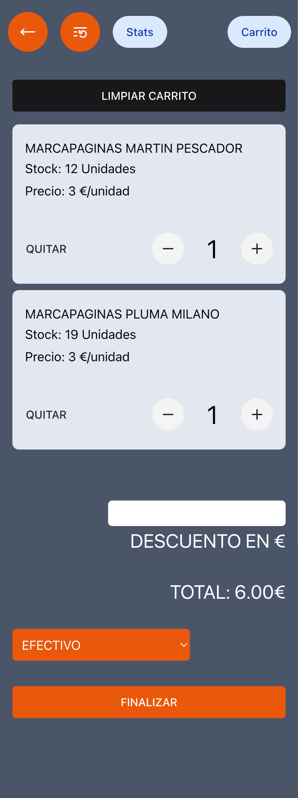

# FIO Stock Control App

This online application helped managing the stock of the store at the International Birding Fair. The data is stored in an Airtable base, which can be easily managed by the client, making this tool user-friendly.

## Features

- Manage products and stock levels
- Create and track sales
- Apply discounts
- Multiple payment methods
- Integration with Airtable Database
- Utilizes Chakra UI for layout components

The tool fetches data from the Airtable Database and categorizes items into groups and subgroups, allowing for easy navigation and selection of products. The Cart displays all selected products and their quantities, along with the total sale price.

Upon completing a sale, the tool sends the sale information to another table in Airtable, which stores the main details of each sale. This feature is useful for clients who want to analyze the collected data.

Airtable is used as it provides an easy way to set up a small backend that can be read and edited directly from the sheet. This allows clients to add new products, modify existing products, and download the information as an Excel or Google Sheets file. The online tool simplifies the process of creating sales and updating stock using just a mobile phone.

## Screenshots

  
  
  
  
  
  
  

---

	
	
	
	
	

